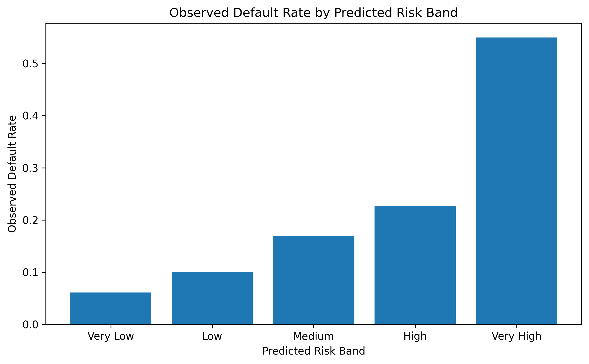
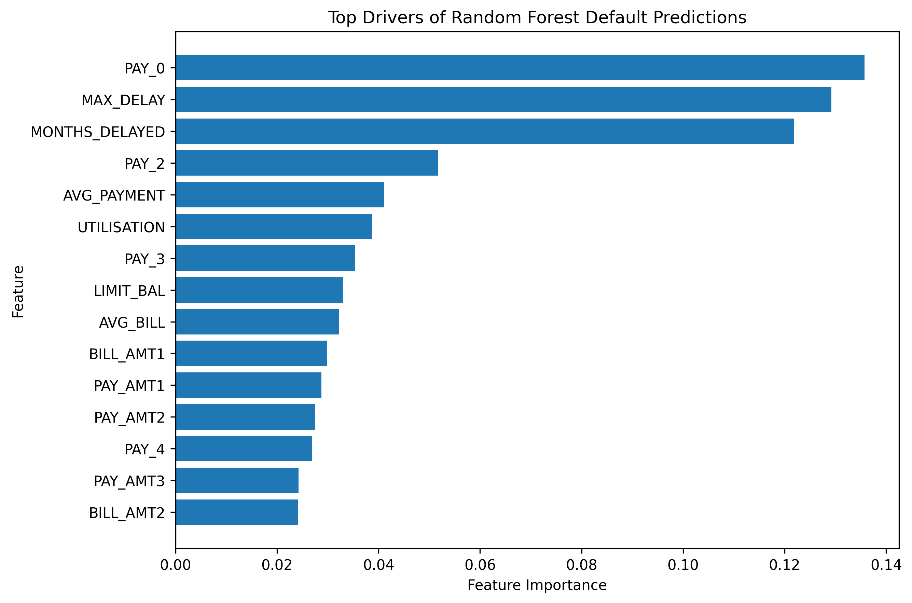
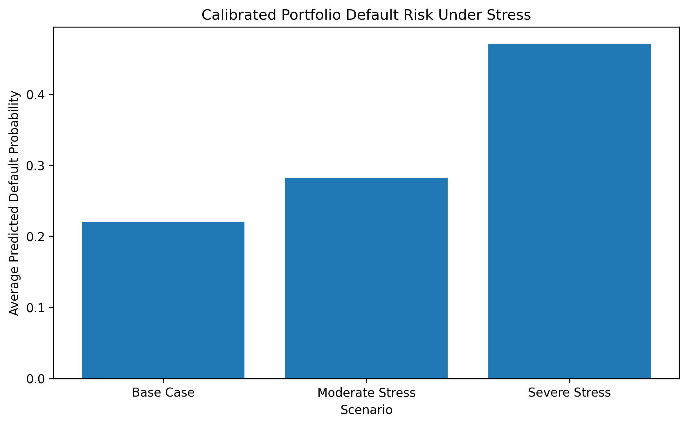

# Credit Default Prediction & Stress Testing Engine

A credit-risk modelling project using Python to predict customer default, calibrate probability estimates, segment borrowers by risk, simulate adverse behavioural stress scenarios, and explore cost-sensitive lending decisions.

The analysis uses the UCI Default of Credit Card Clients dataset, containing 30,000 credit-card customers and historical repayment information.

## Executive summary

A concise one-page summary of the modelling approach, key results and business implications is available here:

[View the Executive Summary](Credit%20Risk%20Executive%20Summary.pdf)

## Project objective

The project answers four practical credit-risk questions:

1. Which customers are most likely to default?
2. Which borrower characteristics are most strongly associated with modelled default risk?
3. How does portfolio-level default risk change under adverse repayment conditions?
4. How should the classification threshold change when missing a real default is more costly than incorrectly flagging a good borrower?

## Methodology

The workflow includes:

- Data cleaning and validation
- Exploratory data analysis
- Feature engineering
- Logistic Regression
- Random Forest classification
- Model evaluation using accuracy, precision, recall, F1 and ROC-AUC
- Probability calibration
- Brier-score evaluation
- Risk-band segmentation
- High-risk customer profiling
- Behavioural stress testing
- Cost-sensitive threshold analysis

Engineered features included:

- Average bill amount
- Average payment amount
- Maximum repayment delay
- Number of delayed months
- Credit utilisation

## Model performance

| Metric | Logistic Regression | Random Forest |
|---|---:|---:|
| Accuracy | 0.745 | 0.778 |
| Precision | 0.444 | 0.498 |
| Recall | 0.606 | 0.582 |
| F1 Score | 0.512 | 0.537 |
| ROC-AUC | 0.754 | 0.775 |

The Random Forest achieved the stronger overall ROC-AUC and F1 score, while Logistic Regression produced slightly higher recall.

This highlights an important credit-risk trade-off: the best model depends not only on overall accuracy, but also on the relative cost of failing to identify actual defaulters.

## Probability calibration

Because class weighting was used to improve sensitivity to the minority default class, the original Random Forest probabilities were materially above the observed portfolio default rate.

- Observed test-set default rate: **22.13%**
- Uncalibrated average Random Forest score: **39.66%**
- Calibrated average predicted probability: **22.08%**

The Brier score improved from:

**0.1696 → 0.1362**

after sigmoid probability calibration.

This represents an improvement of approximately **19.7%** in Brier score.

## Risk segmentation

Customers were ranked by calibrated predicted probability and divided into five equally sized risk groups.

| Risk band | Average predicted risk | Observed default rate |
|---|---:|---:|
| Very Low | 6.29% | 6.09% |
| Low | 9.35% | 10.02% |
| Medium | 13.70% | 16.85% |
| High | 23.85% | 22.70% |
| Very High | 57.19% | 54.96% |

The observed default rate rises from approximately **6.1%** in the lowest-risk group to approximately **55.0%** in the highest-risk group.

The highest-risk 20% of customers captured approximately **49.7% of all observed defaults** and displayed a default rate approximately **2.48× the overall portfolio rate**.



## High-risk borrower profile

Compared with the overall portfolio, customers in the Very High Risk segment showed:

- Approximately **60% lower average payments**
- Approximately **28% higher credit utilisation**
- Approximately **34% lower average credit limits**
- An average of approximately **3.24 delayed months**, compared with **0.84** for the overall portfolio
- Substantially worse recent repayment behaviour

Historical repayment behaviour was also dominant in Random Forest feature importance.



## Stress testing

Three illustrative behavioural scenarios were analysed.

### Base case

Observed borrower conditions.

Average calibrated predicted default probability:

**22.08%**

### Moderate stress

Illustrative assumptions:

- Payments decrease by 10%
- Outstanding bill amounts increase by 5%
- Most recent repayment status deteriorates by one level

Average predicted default probability:

**28.31%**

Relative increase from base:

**28.2%**

### Severe stress

Illustrative assumptions:

- Payments decrease by 25%
- Outstanding bill amounts increase by 10%
- Recent repayment behaviour deteriorates more substantially

Average predicted default probability:

**47.17%**

Relative increase from base:

**113.7%**



These are illustrative behavioural stress scenarios rather than regulatory or macroeconomic forecasts.

## Cost-sensitive threshold analysis

The standard 50% classification threshold was compared with alternative thresholds.

Under an illustrative assumption that failing to identify an actual default is **five times as costly** as falsely flagging a non-defaulting borrower:

| Metric | Standard threshold | Cost-sensitive threshold |
|---|---:|---:|
| Threshold | 0.50 | 0.15 |
| Accuracy | 0.815 | 0.659 |
| Precision | 0.638 | 0.366 |
| Recall | 0.383 | 0.744 |
| F1 Score | 0.479 | 0.491 |
| False Positives | 288 | 1,706 |
| False Negatives | 818 | 340 |
| Illustrative Cost | 4,378 | 3,406 |

The lower threshold substantially increased recall and reduced false negatives, but generated many more false positives.

This demonstrates why classification thresholds should reflect the economic consequences of different errors rather than automatically using 0.50.

Sensitivity analysis produced different preferred thresholds depending on the assumed relative cost of missing defaults:

- **2:1 cost ratio → 0.40 threshold**
- **5:1 cost ratio → 0.15 threshold**
- **10:1 cost ratio → 0.07 threshold**

## Repository structure

```text
credit-risk-stress-testing/
│
├── Credit_Default_Stress_Test.ipynb
│
├── Figures/
│   ├── 01_stress_test.png
│   ├── 02_risk_bands.png
│   └── 03_feature_importance.png
│
├── Results/
│   ├── calibrated_risk_band_summary.csv
│   ├── clean_high_risk_profile.csv
│   ├── final_stress_test_results.csv
│   ├── threshold_comparison.csv
│   ├── threshold_cost_sensitivity.csv
│   └── top_15_feature_importance.csv
│
├── executive_findings.txt
└── project_results.txt
